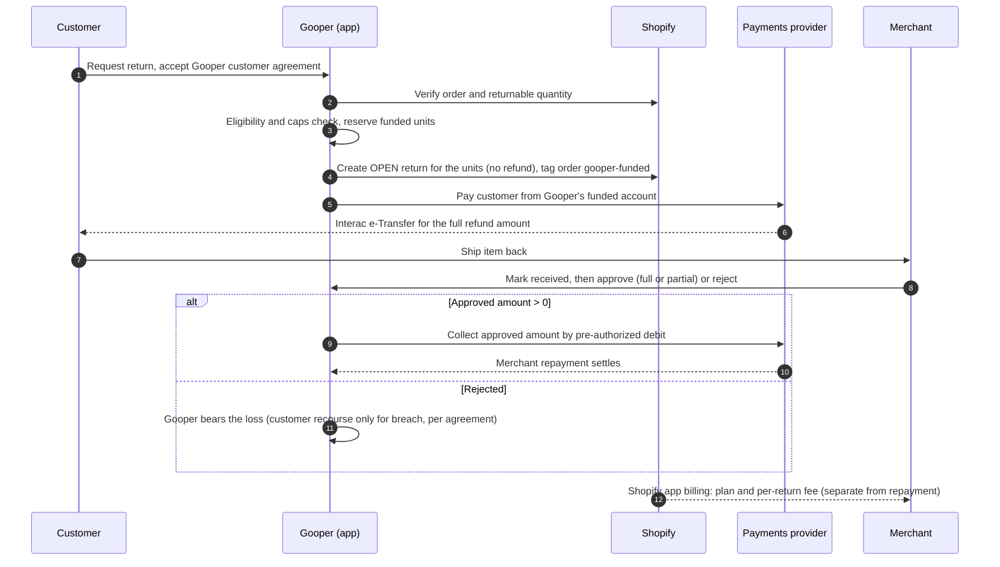

# Gooper-funded returns — Shopify App Review submission package

Draft prepared September 19, 2026, for Eric (Gooper). Not legal advice. Nothing
here has been reviewed by counsel or approved by Shopify, a payments provider or
a regulator.

## How to use this package

Shopify Support (chat with Wolf, September 18, 2026) said the route is to submit
the app through App Store review with an accurate description of the model.
App Review escalates it internally. Support declined to classify the model under
requirements 1.1.15 or 1.1.16; only App Review can.

Shopify's help assistant listed what a submission should include. This package
follows that list:

| # | Shopify asked for | Where | Status |
| --- | --- | --- | --- |
| 1 | Customer agreement | §8 | Term sheet ready; full agreement after Shopify's determination |
| 2 | Merchant agreement | §8 | Term sheet ready; full agreement after Shopify's determination |
| 3 | Fund-flow diagram | §3 | Ready |
| 4 | Reimbursement timing | §4 | Ready, with **proposed** deadlines for Eric to confirm |
| 5 | Underwriting and collections process | §5, §6 | **Proposed** rules for Eric to confirm |
| 6 | Disclosures | §8 | Required points listed; final wording after Shopify's determination |
| 7 | Licensing analysis | §8 | Questions listed; analysis after Shopify's determination (an early, narrow opinion is optional) |
| 8 | Proposed app or partner distribution route | §9 | Ready |

**Submit for a determination now; finalize the legal documents afterwards.**
Shopify's decision is about the model, not finished contracts, and drafting final
agreements first risks paying for them twice if Shopify wants the structure
changed. Send the term sheets and say plainly that the full agreements, disclosures
and licensing analysis will be written to match Shopify's determination. If
Shopify asks for more, that answer tells the lawyer exactly what to produce.

Items marked **[PROVIDER]** depend on which payments provider signs on.

---

## 1. Summary for App Review (paste-ready)

> Gooper.io is an existing Shopify returns app. Today, customers verify a purchase,
> get a return quote and, where the merchant enables it, receive an ordinary refund
> through Shopify's `returnProcess` to the original payment method. That flow is
> unchanged by this submission.
>
> We are asking App Review to assess an optional, separate feature for Canadian
> merchants: **Gooper-funded returns**. When a customer starts an eligible return,
> Gooper buys the customer's claim to that refund and pays the customer from
> Gooper's own funds, through a licensed Canadian payments provider, before the
> item is shipped back. The merchant then repays Gooper, but only after the merchant
> has physically received the item **and** explicitly approved it on inspection.
>
> What the feature does not do:
> - It doesn't process the original purchase, add a checkout payment method, or
>   touch the customer's original payment.
> - It doesn't issue a Shopify refund for funded items. Gooper creates a Shopify
>   return to record them, and the app's ordinary refund flow refuses to refund
>   those units, so the customer can't be paid twice.
> - It doesn't lend to merchants. A merchant owes nothing until they approve a
>   returned item, and then only the approved amount plus the disclosed fee.
>
> The merchant's repayment is documented as repayment of the purchased refund
> claim, under the merchant agreement. It isn't an app charge. Gooper's service fee
> is disclosed and charged separately, through Shopify's app billing.
>
> We have not enabled any live payouts. The flow runs only in a development sandbox
> with a simulated payments provider. We'd like App Review's determination, and any
> required agreement or approval route, before launching. We have attached the
> fund flow, timing, underwriting and collections rules, how double payment is
> prevented, and term sheets for the customer and merchant agreements. The full
> agreements, disclosures and our Canadian licensing analysis will be finalized to
> match your determination.
>
> Our questions:
> 1. Is this model permitted, and which requirements apply (1.1.15, 1.1.16, 1.2)?
> 2. Is an update to our existing app the right route, or is a separate agreement
>    or program required?
> 3. Is it acceptable for the merchant's repayment of approved principal to be
>    collected by pre-authorized debit under our merchant agreement, with our plan
>    and per-return fee charged through Shopify app billing?
> 4. How should the funded Shopify return be closed after repayment, so the
>    merchant's records show the item returned without a Shopify refund and without
>    distorting sales and tax reporting?

## 2. Who is involved

| Party | Role |
| --- | --- |
| Customer | Buys from the merchant, requests a return, sells their refund claim to Gooper, ships the item back |
| Merchant | Shopify store owner, opts in, receives and inspects the item, repays Gooper for approved items, pays Gooper's fee |
| Gooper | Buys the refund claim, funds the customer payout from its own account, collects from the merchant, bears non-return and rejection losses except customer breach |
| Payments provider **[PROVIDER]** | Licensed Canadian provider that sends the customer payout (Interac e-Transfer) and collects from the merchant by pre-authorized debit |
| Shopify | Hosts the order and return; bills the merchant for Gooper's plan and fees |

## 3. Fund flow

Money in plain words:

1. **Gooper → customer:** the full refund amount, from Gooper's own funds, through
   the provider. No fee is deducted from the customer.
2. **Merchant → Gooper:** the approved amount only, by pre-authorized debit, after
   explicit approval. This is repayment of the purchased claim.
3. **Merchant → Gooper, via Shopify billing:** the monthly plan and the per-return
   fee.
4. **No Shopify refund** is issued for funded units, and **no money passes through
   Shopify's checkout or payments.**

## 4. Timing

| Step | When | Status |
| --- | --- | --- |
| Customer payout sent | Right after eligibility passes and the Shopify return is created | Ready |
| Payout arrives | Per provider; Interac e-Transfer usually within minutes, but we won't promise a time until the provider confirms one **[PROVIDER]** | Provider |
| Customer ships item | Within **7 days** of payout (Reshop uses 7) | **Proposed** |
| Merchant inspection | Within **3 business days** of the item arriving. **No automatic approval.** A missed deadline triggers reminders and pauses new funded returns for that merchant; it never creates a debt | **Proposed** |
| Merchant repayment | Pre-authorized debit initiated on approval, with the notice the debit agreement requires | **[PROVIDER]**, lawyer |
| Repayment settles | Per provider and Payments Canada rules, typically a few business days | **[PROVIDER]** |

## 5. Underwriting — who gets a funded return (proposed v1)

A return is funded only when all of these hold. Items marked "enforced" already
exist in the code.

- **Merchant:** opted in, signed the merchant agreement and debit authorization,
  and is based in Canada outside Quebec.
- **Order and item:** Shopify still shows the units as returnable after
  subtracting units Gooper already funded. *(Enforced.)* The order belongs to the
  verified customer and is within the merchant's return window. *(Enforced today
  for ordinary refunds; to be applied to funded returns when customers can start
  them. The sandbox starts funded cases from the merchant side.)*
- **Currency:** CAD. *(Enforced for funded returns on real orders; the synthetic
  sandbox samples also allow USD.)*
- **Per-return cap:** $150 while piloting. *(Enforced at payout request.)*
- **Per-merchant cap:** $1,500 of unrepaid funded returns per merchant, counting
  payouts in flight and anything not yet repaid; new payouts stop when it's
  reached. *(Enforced.)*
- **Portfolio cap:** $14,000 unrepaid across all merchants, per currency, to be set
  from Gooper's committed capital. *(Enforced.)*
- **Customer:** one open funded return at a time while piloting. *(To be enforced
  once customers can start funded returns.)*
- **Kill switch:** `GOOPER_FUNDED_PAUSED=1` stops all new payouts immediately.
  *(Enforced.)*

The cap amounts are proposals awaiting Eric's confirmation. Each is a setting,
so changing them needs no code change.

Customer protections already built:

- The customer isn't notified by Shopify about the return Gooper creates.
- An unknown payout outcome is never paid a second time. Gooper looks it up with
  the provider using the same payment key.
- Contradictory, mismatched or reversed payment results are held for a person to
  review; no balance changes automatically.

## 6. Collections (proposed v1)

- **Trigger:** only the merchant's explicit approval of a received item. Delivery or
  a carrier scan alone never creates a debt.
- **Amount:** only the approved principal. A partial approval collects only that
  part; the rest is Gooper's loss unless the customer breached their agreement.
- **Method:** pre-authorized debit under the merchant's signed business debit
  agreement, through the provider.
- **Failed debit:** retried within the debit agreement's limits. Repeated failure
  pauses the merchant's new funded returns and escalates under the merchant
  agreement.
- **Customer recourse:** only for the customer's own breach (not returning the
  item, returning it in the wrong condition, false information). The amount owed
  is the full original refund. It needs the customer agreement in force first; no
  code can charge a customer today.
- **Double payment:** built and tested (§7). Refunds issued directly in Shopify
  admin can't be blocked, but they are detected and flagged.

## 7. How double payment is prevented (built)

This is the core of the 1.1.15 question.

- **Reserved units.** Gooper records the exact order line items and quantities it
  funded, before any payout.
- **Shopify return.** Gooper creates an OPEN Shopify return for those units without
  a refund, so Shopify stops treating them as returnable. The order is tagged
  `gooper-funded` and `gooper-funded-open`.
- **Refund guard.** Gooper's ordinary refund flow refuses those units twice: before
  asking Shopify for a return, and immediately before `returnProcess`, the only
  place the app moves money. The check fails closed.
- **Outside refunds.** If a Shopify refund touches a funded line item, including
  one made in Shopify admin, the `refunds/create` webhook flags it for review. If
  the funded return is cancelled or declined in Shopify, the `returns/*` webhooks
  flag it, and the refund guard protects those units again.

**Open question for App Review:** once the merchant approves and Gooper is repaid,
how should the funded Shopify return be closed, so the merchant's Shopify records
show the item returned without a Shopify refund and without distorting sales and
tax reporting? We'd like Shopify's recommended approach before building this step.

## 8. For the lawyer (fixed-fee engagement)

Please provide the customer agreement, merchant agreement, disclosures, and a
licensing analysis for a Canadian launch (all provinces except Quebec). The
decisions already made:

- **Structure:** Gooper buys the customer's refund claim against the merchant (a
  purchase of the receivable, not a loan).
- **Customer fee:** none. The customer receives the full refund amount.
- **Merchant pricing:** Starter $49 plus 5% per funded return; Growth $199 plus 4%;
  each with a $2 minimum per return. 60-day trial for early supporters. (To confirm:
  monthly billing, CAD, whether the trial also waives the per-return fee.)
- **Customer breach:** the customer owes the full original refund amount.
- **Non-recourse:** Gooper can't pursue the customer for the merchant's failure to
  pay.

**Customer agreement** must cover:

- the sale of the refund claim to Gooper;
- the customer's promise to return the item in time and in returnable condition;
- what counts as breach;
- repayment of the full refund on breach, and how it would be collected;
- payout method and timing, stated without over-promising;
- privacy;
- disputes.

**Merchant agreement** must cover:

- acceptance of the sale of the claim, which also serves as notice of assignment;
- the merchant pays Gooper instead of the customer;
- receipt and inspection duties and the inspection deadline, with no automatic
  approval;
- partial approval and rejection;
- fees;
- the pre-authorized debit authorization;
- what happens if the merchant also refunds the customer;
- uninstall, insolvency and surviving obligations;
- data handling.

**Disclosures:** to customers, before they accept, that Gooper (not the merchant)
pays them and why; to merchants, fees, timing and their obligations.

**Licensing analysis — questions:**

1. Does Gooper need to register with the Bank of Canada under the Retail Payment
   Activities Act, given that it pays out only its own funds through a licensed
   provider?
2. Is Gooper in FINTRAC scope (money services business)?
3. What does assigning the refund claim require under provincial law, and does the
   merchant agreement give adequate notice?
4. Which provincial consumer-protection rules apply, especially to customer
   repayment on breach?
5. Any other licence or registration for buying consumer refund claims.

## 9. Distribution route

- **Route:** an update to the existing Gooper.io app, submitted through the App
  Store review process, as Shopify Support advised. Not the Payments Platform
  Application: that's invitation-only and for checkout payment methods, and this
  feature adds none.
- **Rollout:** the feature stays off by default. It's enabled per merchant only
  after the merchant signs the merchant agreement and debit authorization.
- **Pilot:** 3 to 5 Canadian merchants outside Quebec, with the caps in §5.
- **Billing:** plan and per-return fee through Shopify's app billing. Repayment of
  approved principal goes through the provider, under the merchant agreement.

## 10. Before submitting — Eric's checklist

Before submitting for a determination:

- [ ] Confirm the proposed items: 7-day ship window, 3-business-day inspection
      deadline, $150 per-return, $1,500 per-merchant and $14,000 portfolio caps,
      one open funded return per customer.
- [ ] Confirm the pricing details: monthly, CAD, what the trial waives.
- [ ] Submit through Partner Dashboard → Apps → Gooper.io → Distribution, or ask
      Partner Support (citing the Wolf chat) to open an App Review case if the app
      is already published. Paste §1 and attach this document.

In parallel:

- [ ] Contact payments providers for Interac e-Transfer payouts and pre-authorized
      debit collection; ask about the use case, fees, timing and a sandbox.

After Shopify's determination:

- [ ] Lawyer drafts the agreements, disclosures and licensing analysis to match it.
- [ ] Provider confirms in writing; update §4 timings and fill every **[PROVIDER]**.
- [ ] Complete any approval or agreement Shopify requires, then pilot.
